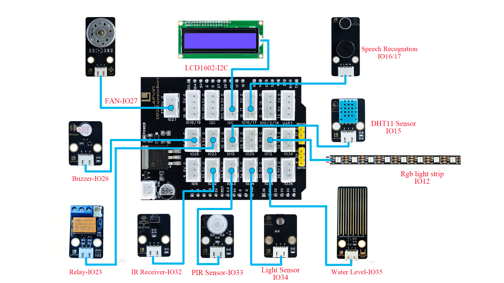

Smart Farm Assembly
==================

.. image:: _static/Assembly/41.com.jpg
   :width: 1000
   :align: center

----

Assembly Video
--------------

- The video contains an assembly tutorial for the smart farm. By watching this video, you can quickly assemble it. 

- If you need a more detailed assembly tutorial, please continue to view the text and image tutorial below.

----

Wiring Diagram
---------------

.. raw:: html

   

.. list-table::
   :header-rows: 1
   :widths: 50 20
   :align: center

   * - Component
     - ESP32 Pin
   * - Relay Module
     - 23
   * - Active Buzzer
     - 26
   * - Fan
     - 27
   * - PIR Sensor
     - 33
   * - Light Sensor
     - 34
   * - Infrared Receiver Module
     - 32
   * - DHT11 Sensor
     - 15
   * - Water Level Sensor
     - 35
   * - Speech Recognition
     - 16, 17
   * - LCD1602
     - I2C-SCL、SDA
   * - RGB Light Strip
     - 12

----

1. Base Assembly
----------------

Step 1: Install ESP32
~~~~~~~~~~~~~~~~~~~~~~

**Step 1-1: Mounting screws**

- **Parts list：** Basswood board with “A”、 M3*6mm screw （4 PCS）、 M3*10mm copper pillar（4 PCS）.

.. image:: _static/Assembly/2.esp32screw1.png
   :width: 800
   :align: center

.. raw:: html

   

.. admonition:: Precautions

  - The serial numbers on the basswood boards are used only to distinguish one board from another. In the tutorial examples, the serial numbers face outward for ease of illustration, but they should face inward during installation. This principle should also be followed for subsequent basswood installations.

----

**Step 1-2: Install ESP32**

- **Parts list：** ESP32 development board、M3*6mm screw （4 PCS）.

.. image:: _static/Assembly/3.esp32.png
   :width: 800
   :align: center

----

Step 2: Install Battery Box
~~~~~~~~~~~~~~~~~~~~~~~~~~~

- **Parts list：** Battery Box 、M3*10mm Flat-head screw （2 PCS）、M3 Nut（2 PCS）.

.. image:: _static/Assembly/4.battary.png
   :width: 800
   :align: center

.. admonition:: Precautions

  - When securing the battery compartment, use flat-head screws. If you use round-head screws, the screws will protrude and press against the battery, preventing it from being installed properly.
  
  - Batteries are not included in the package; you will need to bring your own 6 AA batteries.

----

Step 3: Install Relay Module
~~~~~~~~~~~~~~~~~~~~~~~~~~~~

- **Parts list：** Relay Module 、M3*12mm screw （2 PCS）、M3 Nut（2 PCS）.

.. image:: _static/Assembly/5.relay.png
   :width: 800
   :align: center

.. admonition:: Precautions

   - In this step, connect the expansion board to the ESP32 development board.

   - Then connect the relay module to pin IO23 of the expansion board using a 3-pin wire.

----

Step 4: Install Fence
~~~~~~~~~~~~~~~~~~~~~~

- **Parts list：** Basswood boards with “B, C, D, E”.

.. image:: _static/Assembly/8.fulan.png
   :width: 800
   :align: center

----

Step 5: Install Water Tank
~~~~~~~~~~~~~~~~~~~~~~~~~~~~

- **Parts list：** Water Tank、Glue（3 PCS）.

.. image:: _static/Assembly/6.water.png
   :width: 800
   :align: center

.. admonition:: Precautions

   - Use three round adhesive dots to stick to the bottom of the sink, adjust their position, and fix them to the wooden board A.

----

Step 6：Install Latch
~~~~~~~~~~~~~~~~~~~~~~

- **Parts list：**  Blue Latch（6 PCS）.

.. image:: _static/Assembly/7.latch.png
   :width: 800
   :align: center

----

Step 7：Install Cover Plate
~~~~~~~~~~~~~~~~~~~~~~~~~~~

- **Parts list：** Basswood boards with “F”.

.. image:: _static/Assembly/9.gaiban.png
   :width: 800
   :align: center

----

The assembled base is shown in the picture.
~~~~~~~~~~~~~~~~~~~~~~~~~~~~~~~~~~~~~~~~~~~

.. image:: _static/Assembly/36.step1.png
   :width: 800
   :align: center

----

2. House Assembly
------------------

Step 1：Install Fan Module
~~~~~~~~~~~~~~~~~~~~~~~~~~~

- **Parts list：** Basswood boards with “H”、Fan Module、M3*12mm screw （2 PCS）、M3 Nut（2 PCS）.

.. image:: _static/Assembly/10.fan.png
   :width: 800
   :align: center

.. admonition:: Precautions

  - This step requires using a 3-pin wire to connect the fan module to pin IO27 of the expansion board.

----

Step 2：Install LCD1602 Screen
~~~~~~~~~~~~~~~~~~~~~~~~~~~

- **Parts list：** Basswood boards with “G”、LCD1602 Screen、M3*12mm screw （4 PCS）、M3 Nut（4 PCS）.

.. image:: _static/Assembly/11.lcd.png
   :width: 800
   :align: center

.. admonition:: Precautions

  - This step requires using a 4-pin wire to connect the LCD1602 screen to the I2C pin of the expansion board.

----

Step 3：Install House
~~~~~~~~~~~~~~~~~~~~~

- **Parts list：** Basswood boards with “G、H、J、K”、

.. image:: _static/Assembly/12.house.png
   :width: 800
   :align: center

----

Step 4：Install Roof
~~~~~~~~~~~~~~~~~~~

**Step 4-1:Install sensor Module**

- **Parts list：** Basswood boards with “L”、DHT11 Sensor、PIR  Sensor、Light Sensor、Infrared Receiver Module、M3*12mm screw （8 PCS）、M3 Nut（8 PCS）.

.. image:: _static/Assembly/13.roof.png
   :width: 800
   :align: center

.. admonition:: Precautions

  - This step requires using a 3-pin cable to connect the following sensor module to the expansion board.

  - DHT11 Sensor —— IO15、PIR Sensor —— IO33、Light Sensor —— IO34、Infrared Receiver Module —— IO32.

----

**Step 4-2:Install Solar LED**

- **Parts list：** Basswood boards with “M”、Solar LED、Glue（5 PCS）.

.. image:: _static/Assembly/14.sola.png
   :width: 800
   :align: center

.. admonition:: Precautions

   - In this step, five round adhesive dots are needed to fix the solar panel to the wooden board M.

----

**Step 4-3:Install Roof**

- **Parts list：** Basswood boards with “L、M”、 Blue Latch（4 PCS）.

.. image:: _static/Assembly/15.roof.png
   :width: 800
   :align: center

----

The house is assembled as shown in the picture.
~~~~~~~~~~~~~~~~~~~~~~~~~~~~~~~~~~~~~~~~~~~~~~

.. image:: _static/Assembly/37.step2.png
   :width: 800
   :align: center

----

3. Waterwheel Assembly
----------------------

Step 1：Install Water Pump
~~~~~~~~~~~~~~~~~~~~~~~~~~

- **Parts list：** Basswood boards with “P”、Water Pump、Water Pipe、Glue（1 PCS）.

.. image:: _static/Assembly/17.pipe.png
   :width: 800
   :align: center

.. admonition:: Precautions

   - In this step, connect the water pump to the XH2.54-2Pin interface of the relay module and short COM to GND using a jumper cap.

   - When connecting water pipes, maintain their natural curvature and avoid forcibly bending them at the joints to prevent flattening the pipes and causing water flow interruption. 
   
   - After installation, a water test should be conducted, and the position of the water pipes should be adjusted according to the water flow conditions to ensure that all joints are tightly connected without leaks or overflows.

   - After adjusting the position of the water pipes, you can use round adhesive dots to fix the water pump inside the water tank.

----

Step 2：Install Waterwheel Support
~~~~~~~~~~~~~~~~~~~~~~~~~~~~~~~~~~

- **Parts list：** Yellow painted waterwheel support wooden planks（2 PCS）.

.. image:: _static/Assembly/18.sczj.png
   :width: 800
   :align: center

----

Step 3：Install Water Wheel
~~~~~~~~~~~~~~~~~~~~~~~~~~~

- **Parts list：** Waterwheel（2 PCS）、Waterwheel baffle（10 PCS）.

.. image:: _static/Assembly/16.water1.png
   :width: 800
   :align: center

.. image:: _static/Assembly/16.water2.png
   :width: 800
   :align: center

----

Step 4：Install WaterWheel
~~~~~~~~~~~~~~~~~~~~~~~~~~~

- **Parts list：**  Waterwheel、Circular（4 PCS）、Round Wooden Stick.

.. image:: _static/Assembly/19.gdsc.png
   :width: 800
   :align: center

.. image:: _static/Assembly/19.gdsc2.png
   :width: 800
   :align: center

.. admonition:: Precautions

   - When installing the fixing ring, a gap of about 3mm should be left on both the left and right sides to ensure that the waterwheel can rotate freely.

----

Step 5：Install Water Level Sensor
~~~~~~~~~~~~~~~~~~~~~~~~~~~~~~~~~~~

- **Parts list：**  Basswood boards with “N”、Extended pad（3 PCS）、Water Level Sensor、M3*17mm screw （2 PCS）、M3 Nut（2 PCS）.

.. image:: _static/Assembly/20.level.png
   :width: 800
   :align: center

.. image:: _static/Assembly/20.level2.png
   :width: 800
   :align: center

.. image:: _static/Assembly/20.waterlevel2.png
   :width: 800
   :align: center

.. admonition:: Precautions

   - This step requires using a 3-pin cable to connect the water level sensor to the IO35 pin of the expansion board.

----

The waterwheel assembly is shown in the picture below.
~~~~~~~~~~~~~~~~~~~~~~~~~~~~~~~~~~~~~~~~~~~~~~~~~~~~~~

.. image:: _static/Assembly/40.SC3.jpg
   :width: 800
   :align: center

----

4. Decorative Assembly
-----------------------

Step 1：Install Speech Recognition Module
~~~~~~~~~~~~~~~~~~~~~~~~~~~~~~~~~~~~~~~~~

- **Parts list：** Green apple tree wood board、Speech Recognition Module、M3*12mm screw （2 PCS）、M3 Nut（2 PCS）.

.. image:: _static/Assembly/21.speech.png
   :width: 800
   :align: center

.. image:: _static/Assembly/22.speech2.png
   :width: 800
   :align: center

.. image:: _static/Assembly/23.speech3.png
   :width: 800
   :align: center

.. admonition:: Precautions

   - This step requires using a 4-pin cable to connect the voice recognition module to the IO16/17 pins of the expansion board.

----

Step 2：Install Buzzer Module
~~~~~~~~~~~~~~~~~~~~~~~~~~~~~

- **Parts list：** Yellow short-side fence planks、 Buzzer Module、M3*12mm screw （2 PCS）、M3 Nut（2 PCS）.

.. image:: _static/Assembly/24.buzzer1.png
   :width: 800
   :align: center

.. image:: _static/Assembly/25.buzzer2.png
   :width: 800
   :align: center

.. image:: _static/Assembly/26.buzzer3.png
   :width: 800
   :align: center

.. admonition:: Precautions

   - This step requires using a 3-pin wire to connect the buzzer module to the IO13 pin of the expansion board.

----

Step 3：Install RGB LED Strips
~~~~~~~~~~~~~~~~~~~~~~~~~~~~~

- **Parts list：** Yellow long-side fence planks、RGB LED strips.

.. image:: _static/Assembly/27.rgb1.png
   :width: 800
   :align: center

.. image:: _static/Assembly/28.rgb2.png
   :width: 800
   :align: center

.. admonition:: Precautions

   - First tear off the blue tape on the back of the light strip, and then stick the light strip on the back of the fence.

   - This step requires using a 3-pin wire to connect the RGB LED strip to the IO12 pin of the expansion board.

----

Step 4：Install Feeding Trough
~~~~~~~~~~~~~~~~~~~~~~~~~~~~~

- **Parts list：** Semi-circular feeding trough wooden board （2 PCS）、rectangular feeding trough wooden board（2 PCS）.

.. image:: _static/Assembly/29.feed1.png
   :width: 800
   :align: center

.. image:: _static/Assembly/30.feed2.png
   :width: 800
   :align: center

.. image:: _static/Assembly/31.feed3.png
   :width: 800
   :align: center

----

Step 5：Install the sheep
~~~~~~~~~~~~~~~~~~~~~~~~~~

- **Parts list：** Sheep plank.

.. image:: _static/Assembly/32.sheep.png
   :width: 800
   :align: center

----

Step 6：Install Fence Gate
~~~~~~~~~~~~~~~~~~~~~~~~~~

- **Parts list：** Bull-head shaped fence gate planks

.. image:: _static/Assembly/33.gate.png
   :width: 800
   :align: center

----

Step 7：Install Windmill Blades
~~~~~~~~~~~~~~~~~~~~~~~~~~~~~~~

- **Parts list：** Green windmill blade wooden board

.. image:: _static/Assembly/34.sy.png
   :width: 800
   :align: center

----

Step 8：Install Latch
~~~~~~~~~~~~~~~~~~~~

- **Parts list：** Blue Latch（4 PCS）

.. image:: _static/Assembly/35.latch.png
   :width: 800
   :align: center

.. admonition:: Precautions

   - After ensuring the module's wiring is connected and the power-on test shows no problems, install the latches and tighten them.

----
