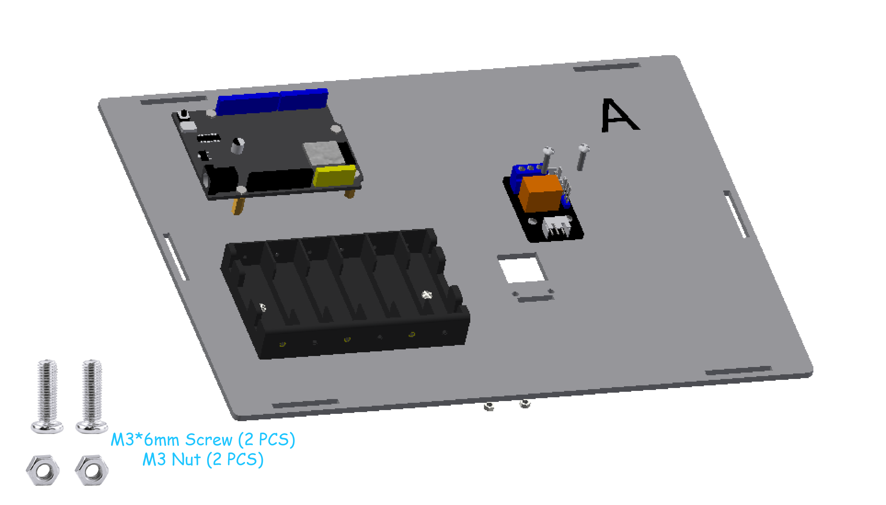
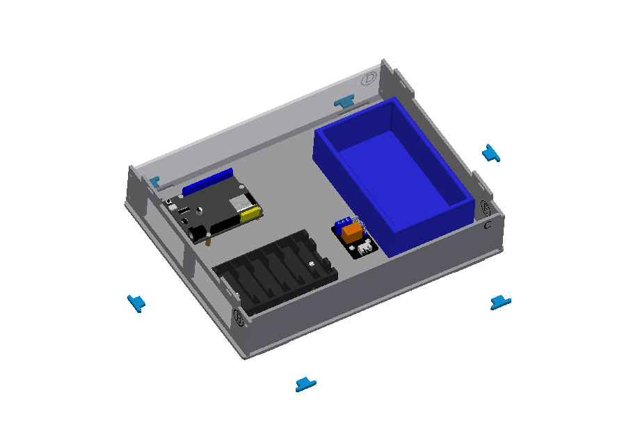

Smart Farm Assembly
==================

Assembly Video
--------------

Wiring
------

.. image:: _static/Assembly/1.WIRING.png
   :width: 800
   :align: center

.. raw:: html

   

.. list-table::
   :header-rows: 1
   :widths: 50 20
   :align: center

   * - Component
     - ESP32 Pin
   * - Relay Module
     - 23
   * - Active Buzzer
     - 13
   * - Fan
     - 27
   * - PIR Sensor
     - 33
   * - LED
     - 26
   * - Light Sensor
     - 34
   * - Infrared Receiver Module
     - 32
   * - DHT11 Sensor
     - 15
   * - Water Level Sensor
     - 35
   * - Speech Recognition
     - 16, 17
   * - LCD1602
     - I2C-SCL, SDA
   * - RGB Light Strip
     - 12
    
----

1. Base Assembly
----------------

Step 1: Install ESP32
~~~~~~~~~~~~~~~~~~~~~~

**Step 1-1: Mounting screws**

- **Parts list：** Basswood board with “A”、 M3*6mm screw （4 PCS）、 M3*10mm copper pillar（4 PCS）.

.. image:: _static/Assembly/2.esp32screw1.png
   :width: 800
   :align: center

.. admonition:: Precautions

  - The serial numbers on the basswood boards are used only to distinguish one board from another. In the tutorial examples, the serial numbers face outward for ease of illustration, but they should face inward during installation. This principle should also be followed for subsequent basswood installations.

----

**Step 1-2: Fixed ESP32**

- **Parts list：** ESP32 development board、M3*6mm screw （4 PCS）.

.. image:: _static/Assembly/3.esp32.png
   :width: 800
   :align: center

----

Step 2: Install Battery Box
~~~~~~~~~~~~~~~~~~~~~~~~~~~

- **Parts list：** Battery Box 、M3*10mm Flat-head screw （2 PCS）、M3 Nut（2 PCS）.

.. image:: _static/Assembly/4.battary.png
   :width: 800
   :align: center

.. admonition:: Precautions

  - When securing the battery compartment, use flat-head screws. If you use round-head screws, the screws will protrude and press against the battery, preventing it from being installed properly.

----

Step 3: Install Relay Module
~~~~~~~~~~~~~~~~~~~~~~~~~~~~

- **Parts list：** Relay Module 、M3*12mm screw （2 PCS）、M3 Nut（2 PCS）.

----

Step 4: Install Water Tank
~~~~~~~~~~~~~~~~~~~~~~~~~~~~

- **Parts list：** Water Tank、Glue（3 PCS）.

.. image:: _static/Assembly/6.water.png
   :width: 800
   :align: center

----

Step 5: Install Fence
~~~~~~~~~~~~~~~~~~~~~~

- **Parts list：** Basswood boards with “B, C, D, E”.

.. image:: _static/Assembly/8.fulan.png
   :width: 800
   :align: center

----

Step 6：Install Latch
~~~~~~~~~~~~~~~~~~~~~~

- **Parts list：**  Blue Latch（6 PCS）.

----

Step 7：Install Cover Plate
~~~~~~~~~~~~~~~~~~~~~~~~~~~

- **Parts list：** Basswood boards with “F”.

.. image:: _static/Assembly/9.gaiban.png
   :width: 800
   :align: center

----

Installation rendering of the base section
~~~~~~~~~~~~~~~~~~~~~~~~~~~~~~~~~~~~~~~~~~~

----

2. House Assembly
------------------

Step 1：Install Fan Module
~~~~~~~~~~~~~~~~~~~~~~~~~~~

- **Parts list：** Basswood boards with “G”、Fan Module、M3*12mm screw （2 PCS）、M3 Nut（2 PCS）.

.. image:: _static/Assembly/10.fan.png
   :width: 800
   :align: center

----

Step 2：Install Fan Module
~~~~~~~~~~~~~~~~~~~~~~~~~~~

- **Parts list：** Basswood boards with “H”、LCD1602 Screen、M3*12mm screw （4 PCS）、M3 Nut（4 PCS）.

.. image:: _static/Assembly/11.lcd.png
   :width: 800
   :align: center

----

3. Waterwheel Assembly
---------------------

4. Decorative assembly
-----------------------
