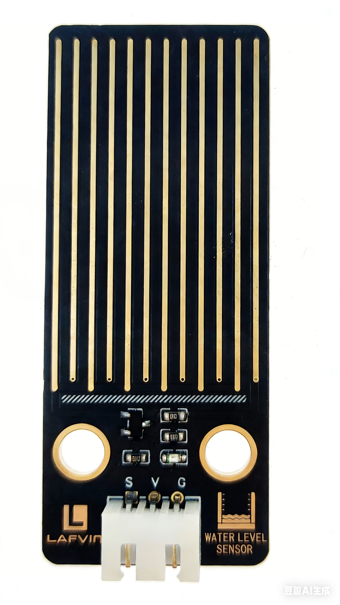

Components Introduction
=======================

**Below is the introduction to each component, which contains the operating principle of the component.**

----

1. ESP32 DevKit
---------------

The development board features the ESP32-WROOM-32E module, which has been optimized in chip manufacturing process, effectively reducing power consumption and improving signal quality, thus ensuring a stable and reliable user experience. 

This module supports 2.4 GHz Wi-Fi and Bluetooth dual-mode communication, and is equipped with a dual-core Xtensa 32-bit LX6 processor with a clock speed of up to 240MHz, 448KB ROM, 520KB SRAM, and 16KB RTC SRAM, as well as 4MB of external Flash memory. 

Furthermore, the development board provides up to 26 I/O interfaces, making it suitable for IoT scenarios such as embedded systems, smart homes, and wearable electronic devices. It is compatible with various common development environments such as Arduino, combining excellent performance with outstanding ease of use.

.. image:: _static/Component/4.esp32.png
   :width: 800
   :align: center

The 26 I/O pins are brought out using female headers for easy connection with DuPont wires;

.. image:: _static/Component/5.esp32.png
   :width: 800
   :align: center

It features an onboard 2.54mm pitch S/V/G expansion header interface, with independent I2C, SPI, and ADC pins; it also has an independent 5V power supply output;

.. image:: _static/Component/6.esp32.png
   :width: 800
   :align: center

----

2. ESP32 expansion board
------------------------

The ESP32 expansion board is designed specifically for the ESP32-DevKit and uses the XH2.54 standard interface to prevent incorrect connections. 

.. image:: _static/Component/1.EXB.png
   :width: 800
   :align: center

.. raw:: html

   

This design enhances the connection process and improves development efficiency. Furthermore, an integrated voltage regulator chip ensures stable circuit operation, and two rows of pins provide users with flexible wiring options.

Basic specifications include: 

- 13 three-pin input/output pins（for analog and digital connections）, compatible with 5V power; 
- Two four-pin digital connectors（containing two signal connections, one power connection, and one ground connection）; 
- One additional four-pin digital connector（with three signal connections and one ground connection）; 
- Two I2C connections; one serial communication port; and two 2.54mm pitch pins for easy connection of servos.

----

3. Water Level Sensor
----------------------

.. raw:: html

   

The water level sensor transmits the sensed water level signal to the controller, and the computer in the controller compares the measured water level signal with the set signal to derive the deviation, and then issues “on” and “off” commands to the feedwater electric valve according to the nature of the deviation to ensure that the vessel reaches the set water level.

The water level sensor has twelve exposed copper traces, six for the Power traces and six for the Sensor traces, which are crossed and bridged by water when flooded. The circuit board has a power LED that lights up when the board is energized.

The combination of these traces acts like a variable resistor, changing the resistance value according to the water level. To be more precise, the more water the sensor is immersed in, the better the conductivity and the lower the resistance. Conversely, the less conductive it is, the higher the resistance. Next, the sensor will process the output signal voltage which will be sent to the microcontroller, thus helping us to determine the water level.

.. warning::

   The sensor cannot be fully submerged in water, please only leave the part where the ten traces are located in contact with water. In addition, energizing the sensor in a humid environment will speed up the corrosion of the probe and cut the life of the sensor, so we recommend that you only supply power when taking readings.

----

4. DHT11 Sensor
---------------

.. image:: _static/Component/9.DHT11.png
   :width: 200
   :align: center

.. raw:: html

   

The digital temperature and humidity sensor DHT11 is a composite sensor that contains a calibrated digital signal output of temperature and humidity. 
The technology of a dedicated digital modules collection and the temperature and humidity sensing technology are applied to ensure that the product has high reliability and excellent long-term stability.

The sensor includes a resistive sense of wet component and an NTC temperature measurement device, and is connected with a high-performance 8-bit microcontroller. 

Only three pins are available for use: VCC, GND, and Signal. 
The communication process begins with the DATA line sending start signals to DHT11, and DHT11 receives the signals and returns an answer signal. 
Then the host receives the answer signal and begins to receive 40-bit humiture data (8-bit humidity integer + 8-bit humidity decimal + 8-bit temperature integer + 8-bit temperature decimal + 8-bit checksum).

**Features**

    #. Humidity measurement range: 20 - 90%RH
    #. Temperature measurement range: 0 - 60℃
    #. Output digital signals indicating temperature and humidity
    #. Working voltage:DC 5V; 
    #. Humidity measurement accuracy: ±5%RH
    #. Temperature measurement accuracy: ±2℃

----

5. PIR sensor
--------------

.. image:: _static/Component/7.pir.png
   :width: 200
   :align: center

.. raw:: html

   

The PIR sensor detects infrared heat radiation that can be used to detect the presence of organisms that emit infrared heat radiation.

Passive infrared sensor (PIR sensor) is a common sensor that can measure infrared (IR) light emitted by objects in its field of view. Simply put, it will receive infrared radiation emitted from the body, thereby detecting the movement of people and other animals. More specifically, it tells the main control board that someone has entered your room.

.. image:: _static/Component/21.pir.png
   :width: 800
   :align: center

.. raw:: html

   

The PIR sensor has two LEDs. When it is powered on normally, the red light will light up, and when it detects a human body, the blue light will light up.

----

6. Light Sensor
---------------

.. image:: _static/Component/12.light.png
   :width: 200
   :align: center

.. raw:: html

   

Light sensors are mainly composed of photoresistor.

.. image:: _static/Component/15.light2.png
   :width: 200
   :align: center

.. raw:: html

   

Photoresistor is simply a light sensitive resistor. It is an active component that decreases resistance with respect to receiving luminosity (light) on the component’s light sensitive surface. Photoresistor’s resistance value will change in proportion to the ambient light detected. With this characteristic, we can use a Photoresistor to detect light intensity. The Photoresistor and its electronic symbol are as follows.

----

7. Infrared Receiver Module
---------------------------

.. image:: _static/Component/8.IR.png
   :width: 200
   :align: center

.. raw:: html

   

An infrared-receiver is a component which receives infrared signals and can independently receive infrared rays and output signals compatible with TTL level. It is similar with a normal plastic-packaged transistor in size and is suitable for all kinds of infrared remote control and infrared transmission.

Infrared, or IR, communication is a popular, low-cost, easy-to-use wireless communication technology. Infrared light has a slightly longer wavelength than visible light, so it is imperceptible to the human eye - ideal for wireless communication. A common modulation scheme for infrared communication is 38KHz modulation.

----

8. Active Buzzer Module
-----------------------

.. image:: _static/Component/10.BUZZER.png
   :width: 200
   :align: center

.. raw:: html

   

Electronic buzzers, featuring a compact design, are versatile components powered by direct current (DC) and are commonly found across a variety of electronic devices. They serve as auditory indicators in applications such as computers, printers, photocopiers, security systems, electronic playthings, vehicular electronics, telephones, and timing devices, among others.

Classification of buzzers is based on their functionality, distinguishing between active and passive types.

.. image:: _static/Component/11.BUZZER2.png
   :width: 200
   :align: center

.. raw:: html

   

The operational distinction between active and passive buzzers is characterized by their internal circuitry and activation requirements:

- **Active Buzzers** are self-contained, featuring an integrated oscillating circuit that produces sound immediately when powered by DC. Their design eliminates the need for external signal modulation to generate audible tones.

- **Passive Buzzers** lack an internal oscillating circuit, and thus, are non-responsive to DC signals in terms of sound output. To induce sound from a passive buzzer, a specific frequency range of square wave signals, typically between 2 kHz and 5 kHz, must be supplied.

The presence of these internal oscillating circuits in active buzzers contributes to their higher cost in comparison to passive models, which require additional circuitry for sound emission.

**The active buzzer used in this kit**

----

9. Relay Module
----------------

.. image:: _static/Component/17.RELAY.png
   :width: 200
   :align: center

.. raw:: html

   

Relay is a device which is used to provide connection between two or more points or devices in response to the input signal applied. In other words, relays provide isolation between the controller and the device as devices may work on AC as well as on DC. However, they receive signals from a microcontroller which works on DC hence requiring a relay to bridge the gap. Relay is extremely useful when you need to control a large amount of current or voltage with small electrical signal.

There are 4 parts in every relay:

**Electromagnet** - It consists of an iron core wounded by coil of
wires. When electricity is passed through, it becomes magnetic.
Therefore, it is called electromagnet.

**Armature** - The movable magnetic strip is known as armature. When
current flows through them, the coil is it energized thus producing a
magnetic field which is used to make or break the normally open (N/O) or
normally close (N/C) points. And the armature can be moved with direct
current (DC) as well as alternating current (AC).

**Spring** - When no currents flow through the coil on the
electromagnet, the spring pulls the armature away so the circuit cannot
be completed.

Set of electrical **contacts** - There are two contact points:

-  Normally open - connected when the relay is activated, and disconnected when it is inactive.

-  Normally close - not connected when the relay is activated, and connected when it is inactive.

.. image:: _static/Component/16.relay2.png
   :width: 800
   :align: center

.. raw:: html

   

The working principle of relay is simple. When power is supplied to the relay, currents start flowing through the control coil; as a result, the electromagnet starts energizing. Then the armature is attracted to the coil, pulling down the moving contact together thus connecting with the normally open contacts. So the circuit with the load is energized. Then breaking the circuit would a similar case, as the moving contact will be pulled up to the normally closed contacts under the force of the spring. In this way, the switching on and off of the relay can control the state of a load circuit.

**This kit uses a custom relay module. Simply plug the device to be controlled directly into the XH2.54-2PIN interface and connect COM and GND with a jumper cap to achieve direct control of the device. This plug-and-play design eliminates the need for screwing in traditional wiring and is widely compatible with various common devices, such as motors.**

----

10. Speech Recognition Module
-----------------------------

.. image:: _static/Component/18.SPEECH.png
   :width: 200
   :align: center

.. raw:: html

   

This kit uses a high-performance offline speech recognition module. Its biggest feature is that it does not require an internet connection; all speech recognition and processing are completed locally on the chip, resulting in fast response and privacy protection.

It can communicate with main control chips such as Arduino, ESP32, and STM32, and send the recognition results as commands to achieve more complex system control.

This module works by converting sound into electrical signals using a microphone, then extracting sound features using a built-in chip to quickly match pre-set wake-up words and command words (such as turning on a water pump). Once the recognition is successful, it will immediately execute the preset action, such as directly controlling a pin to output a high level to turn on a desk lamp, or sending commands to other controllers via serial port.

----

11. RGB Strip Light
------------------

.. image:: _static/Component/13.rgb.png
   :width: 800
   :align: center

.. raw:: html

   

The WS2812 RGB 8 LEDs Strip is composed of 8 RGB LEDs. Only one pin is required to control all the LEDs. Each RGB LED has a WS2812 chip, which can be controlled independently. It can realize 256-level brightness display and complete true color display of 16,777,216 colors. At the same time, the pixel contains an intelligent digital interface data latch signal shaping amplifier drive circuit, and a signal shaping circuit is built in to effectively ensure the color height of the pixel point light Consistent.

It is flexible, can be docked, bent, and cut at will, and the back is equipped with adhesive tape, which can be fixed on the uneven surface at will, and can be installed in a narrow space.

WS2812B is a intelligent control LED light source that the control circuit and RGB chip are integrated in a package of 5050 components. It internal include intelligent digital port data latch and signal reshaping amplification drive circuit. Also include a precision internal oscillator and a 12V voltage programmable constant current control part, effectively ensuring the pixel point light color height consistent.

The data transfer protocol use single NZR communication mode. After the pixel power-on reset, the DIN port receive data from controller, the first pixel collect initial 24bit data then sent to the internal data latch, the other data which reshaping by the internal signal reshaping amplification circuit sent to the next cascade pixel through the DO port. After transmission for each pixel, the signal to reduce 24bit. pixel adopt auto resha -ping transmit technology, making the pixel cascade number is not limited the signal transmission, only depend on the speed of signal transmission.

.. image:: _static/Component/14.rgb.png
   :width: 800
   :align: center

.. raw:: html

   

LED with low driving voltage, environmental protection and energy saving, high brightness, scattering angle is large, good consistency, low power, long life and other advantages. The control chip integrated in LED above becoming more simple circuit, small volume, convenient installation.

----

12. Water Pump
-------------

.. image:: _static/Component/3.pump.png
   :width: 800
   :align: center

.. raw:: html

   

    
This pump essentially functions as a DC motor, operating at a voltage of 3V and a current of 100mA. Upon powering, the pump draws water in from the bottom of its plastic casing and expels it from the outlet pipe. It must always be kept immersed in water to function properly. Reversing the polarity won't turn it into a water intake device; it will only pump water out!

It's highly suitable for beginners to create a fountain or plant watering project using this submersible pump, as it is incredibly user-friendly!

**Features**

* **Voltage Scope**: DC 3 ~ 4.5V
* **Operating Current**: 120 ~ 180mA
* **Power**: 0.36 ~ 0.91W
* **Max Water Head**: 0.35 ~ 0.55M
* **Max Flow Rate**: 80 ~ 100 L/H
* **Continuous Working Life**: 100 hours
* **Water Fing Grade**: IP68
* **Driving Mode**: DC, Magnetic Driving
* **Material**: Engineering Plastic
* **Outlet Outside Diameter**: 7.8 mm
* **Outlet Inside Diameter**: 6.5 mm
* It is a submersible pump and should be used that way. It tends to heat too much that there's a risk of overheating if you turn it on unsubmerged.

----

13. LCD 1602 Screen
-------------------

.. image:: _static/Component/19.lcd.png
   :width: 800
   :align: center

.. raw:: html

   

The LCD1602 Display Screen can display 2 lines of characters in 16 columns. It is capable of displaying numbers,letters, symbols, ASCII code and so on.

I2C LCD1602 Display Screen integrates an I2C interface, which connects the serial-input & parallel-output module to the LCD1602 Display Screen. This allows us to use only 4 lines to the operate the LCD1602.

.. image:: _static/Component/20.lcd2.png
   :width: 800
   :align: center

.. raw:: html

   

**Potentiometer:** It is used to adjust the contrast (the clarity of the displayed text), which is increased in the clockwise direction and decreased in the counterclockwise direction.

----

14. Motor Fan Module
---------------------

.. image:: _static/Component/22.fan.png
   :width: 200
   :align: center

.. raw:: html

   

A DC motor is a motor that converts DC electrical energy into mechanical energy. Because of its good speed regulation performance, it is widely used in electric drive. 

According to the excitation mode, DC motors are divided into three types:permanent magnet, separate excitation and self-excitation. 

When the DC power supply supplies power to the armature winding through the brush, the current in the same direction can flow through the N-pole lower conductor on the armature surface

According to the left-hand rule, the conductor will be subjected to counterclockwise torque; the S-pole lower part of the armature surface The conductor also flows in the same direction, and according to the left-hand rule, the conductor will also be subjected to a counterclockwise moment.

In this way, the entire armature winding, that is, the rotor, will rotate counterclockwise, and the input DC electrical energy will be converted into mechanical energy output on the rotor shaft. 

----
